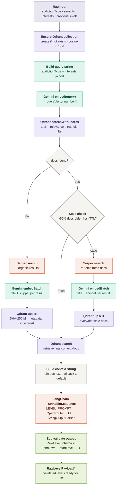

# reNove - RAG Pipeline Flow

### Color key

| Color | Represents |
|---|---|
| Purple | Qdrant vector store operations |
| Teal | Gemini embedding operations |
| Coral | Serper search + LangChain chain |
| Green | Validated output |
| Gray | Input / logic / context building |